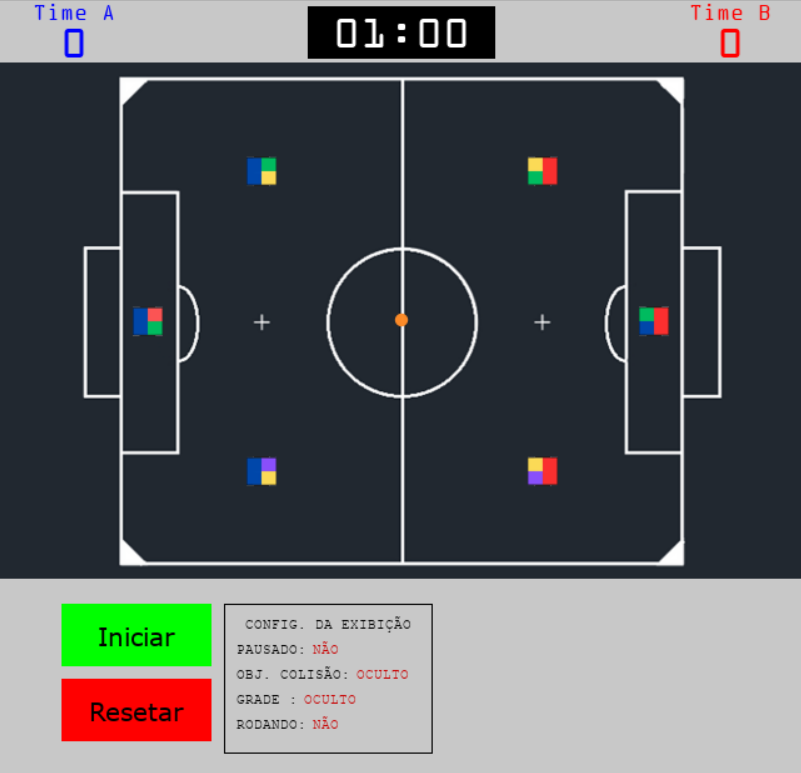
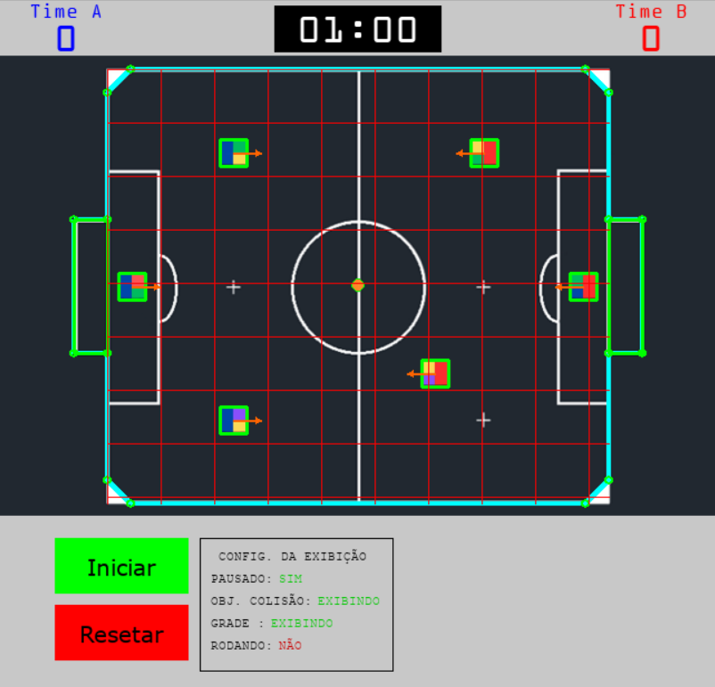
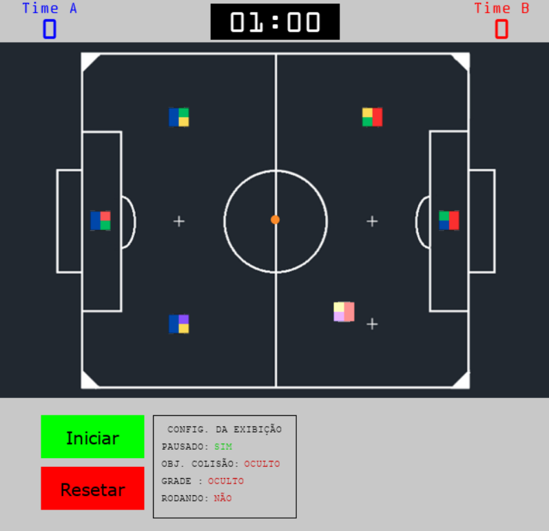

Aqui está o README atualizado com as novas informações sobre as futuras implementações:

---

# ⚽ **FoxSIM - Simulador de Futebol de Robôs**

Bem-vindo ao **FoxSIM**, um simulador de futebol de robôs 2D projetado para experimentação com física realista, controle autônomo e algoritmos de inteligência artificial. Este projeto é ideal para fins educacionais, pesquisa e desenvolvimento de estratégias para times de robôs em partidas simuladas.


## 🎯 **Objetivo do Projeto**

O **FoxSIM** foi criado para:
- Simular partidas de futebol de robôs com física realista.
- Permitir o desenvolvimento e teste de estratégias de controle autônomo.
- Servir como uma ferramenta educacional para aprendizado de física, programação e inteligência artificial.

---

## 🚀 **Funcionalidades Principais**

- **Física Realista**: Sistema completo de colisões e torque usando vetores e matrizes com `NumPy`.
- **Robôs Autônomos**: Cada robô pode ser programado com papéis táticos (como atacante, defensor, goleiro).
- **Interface com `Pygame`**: Permite interações via mouse e teclado, exibição do placar e debug visual.
- **Configuração Personalizável**: Parâmetros como velocidade dos robôs, dimensões do campo e tempo podem ser modificados.
- **Debug Visual**: Possibilidade de exibir objetos de colisão e grades para fins de depuração.
- **Controle de Partida**: Temporizador, pausa, reinício e controle de estados do jogo.
- **Interação via Mouse**: Permite selecionar robôs, mover a bola e rotacionar robôs manualmente.
- **Sistema de Regras**: Um árbitro virtual analisa o estado do jogo e decide quando a partida termina.

---
## 📸 **Galeria de Imagens**

Aqui você pode adicionar imagens e prints do simulador para torná-lo mais visual e interativo. 

### **Exemplo de Simulação**



### **Debug Visual Ativado**
O debug visual é acionado pressionando a tecla **"d"**, e para exibir a grade pressione a tecla em **"i"**.



### **Selecionando robôs com o mouse**




### 🕹️ **Interações no Modo Pausado**

Quando o jogo está pausado (pressionando a tecla **"P"**), você pode interagir diretamente com os elementos do campo de forma intuitiva e divertida! Confira as funcionalidades disponíveis:

- **Seleção de Robôs**:
  - Clique em um robô para selecioná-lo. O robô selecionado será destacado com um brilho especial, indicando que está pronto para ser manipulado.

- **Mover Robôs**:
  - Segure o botão esquerdo do mouse e arraste o robô para reposicioná-lo no campo. Ideal para ajustar estratégias ou corrigir posições.

- **Rotacionar Robôs**:
  - Clique com o botão direito do mouse em um robô para rotacioná-lo. Isso permite ajustar a direção do robô para jogadas específicas.

- **Reposicionar a Bola**:
  - Clique em qualquer lugar do campo (fora dos robôs) para reposicionar a bola naquele local. Perfeito para simular cobranças de falta, escanteios ou reinícios de jogo.

> **Dica**: Use essas funcionalidades para criar cenários personalizados, testar estratégias ou simplesmente se divertir ajustando os elementos do simulador!

---

Essa descrição pode ser adicionada ao README na seção de funcionalidades ou interações, tornando o projeto mais atrativo e fácil de entender. 🎉
---


## 📁 **Estrutura do Projeto**

```plaintext
FoxSIM/
│
├── src/
│   ├── main.py                         # Entrada principal do simulador
│   ├── test.py                         # Testes gerais
│   ├── testInterface.py                # Testes com a interface PyQt5
│   ├── assets/                         # Imagens e sprites do jogo
│   │   ├── ball.png                    # Imagem da bola
│   │   ├── robot.png                   # Imagem dos robôs
│   │   ├── field.png                   # Imagem do campo
│   │   └── ...                         # Outros ícones e imagens
│   ├── simulator/                      # Núcleo da simulação
│   │   ├── objects/                    # Elementos físicos do jogo
│   │   │   ├── ball.py                 # Classe da bola
│   │   │   ├── robot.py                # Classe dos robôs
│   │   │   ├── team.py                 # Classe das equipes
│   │   │   ├── field.py                # Classe do campo
│   │   │   ├── timer.py                # Temporizador do jogo
│   │   │   └── OBJECTS_README.md       # Documentação dos objetos
│   │   ├── collision/                  # Sistema de colisão
│   │   │   ├── collision.py            # Colisão via SAT, AABB, etc.
│   │   │   └── COLISION_README.md      # Documentação do sistema de colisão
│   │   ├── rules/                      # Regras do jogo
│   │   │   └── rules.py                # Classe de regras e lógica do árbitro
│   │   ├── game_logic.py               # Regras e atualização do jogo
│   │   └── simulator.py                # Classe geral da simulação
│   ├── ui/                             # Interface gráfica
│   │   ├── interface.py                # Classe principal da interface
│   │   ├── interface_config.py         # Configurações da interface
│   │   ├── scoreboard.py               # Placar visual
│   │   └── README.md                   # Documentação da interface
│   ├── utils/                          # Funções auxiliares
│   │   └── helpers.py                  # Funções utilitárias
│   └── data/                           # Dados e testes
│       ├── redes/                      # Dados de redes neurais (em construção)
│       └── testes/                     # Testes de PID e trajetórias
├── README.md                           # Documentação principal
└── requirements.txt                    # Dependências do projeto
```

---

## 🛠️ **Tecnologias Utilizadas**

- **Python 3.8+**
- **Bibliotecas**:
  - `pygame`: Para renderização gráfica e controle de eventos.
  - `pygame_gui`: Para elementos de interface gráfica.
  - `numpy`: Para cálculos matemáticos e vetoriais.
  - `shapely`: Para cálculos geométricos e manipulação de polígonos.
  - `matplotlib`: Para visualização de gráficos (opcional).
  - `PyQt5`: Para interfaces gráficas avançadas.
  - `scipy`: Para cálculos científicos e interpolação.
  - `logging`: Para registro de logs e depuração.
  - `os` e `sys`: Para manipulação de arquivos e caminhos.
  - `time`: Para controle de tempo e medições de desempenho.
  - `random`: Para geração de valores aleatórios.
  - `json`: Para manipulação de configurações e dados.
  - `pickle`: Para serialização de objetos.
- **Arquitetura Modular**:
  - Sistema de colisão baseado no **Separating Axis Theorem (SAT)**.
  - Estrutura de objetos para robôs, bola, campo e equipes.
  - Implementação de códigos para controle PID e inteligência artificial.

---

## 🔧 **Configurações e Parâmetros Editáveis**

Os parâmetros do simulador podem ser ajustados no arquivo `interface_config.py`. Alguns exemplos incluem:

- **Dimensões do campo**: `FIELD_WIDTH`, `FIELD_HEIGHT`
- **Tempo de partida**: `TIMER_PARTY`
- **Cores dos times**: `TEAM_BLUE_COLOR`, `TEAM_RED_COLOR`
- **Massa, inércia e coeficientes físicos dos objetos**
- **Opções de visualização (debug)**

---

## 🌟 **Como Executar**

1. Clone o repositório:
   ```bash
   git clone https://github.com/seu-usuario/FoxSIM.git
   ```

2. Navegue até o diretório do projeto:
   ```bash
   cd FoxSIM
   ```

3. Instale as dependências:
   ```bash
   pip install -r requirements.txt
   ```

4. Execute o simulador:
   ```bash
   python src/main.py
   ```

---

## 🏗️ **Futuras Implementações**

- **Integração com IA**:
  - Implementar algoritmos de tomada de decisão para os robôs.
- **Renderização com OpenGL**:
  - Migrar o sistema de renderização para `PyQt5` com suporte a OpenGL.
- **Controle PID Realista**:
  - Adicionar controle PID para os robôs simulados.
- **Simulação em Lote**:
  - Permitir testes de estratégias com múltiplas partidas simuladas.
- **Melhoria de Performance**:
  - Otimizar o sistema com multithreading ou GPU.
- **Interface Completa em PyQt5**:
  - Substituir a interface atual por uma interface mais avançada e interativa usando PyQt5.
- **Integração com o Sistema VSSS Vysion**:
  - Conectar o simulador ao sistema [VSSS Vysion](https://github.com/vsss/vsss-vysion) para controle e visão computacional.

---

## 🤝 **Contribuindo com o Projeto**

Contribuições são bem-vindas! Siga os passos abaixo para colaborar:

1. **Faça um Fork** do repositório.
2. Crie uma nova branch para sua funcionalidade ou correção:
   ```bash
   git checkout -b minha-feature
   ```
3. Faça suas alterações e commit:
   ```bash
   git commit -m "Adiciona minha nova funcionalidade"
   ```
4. Envie suas alterações:
   ```bash
   git push origin minha-feature
   ```
5. Abra um **Pull Request** no repositório principal.

---

## 📄 **Licença**

Este projeto está licenciado sob a MIT License.

---

## 💬 **Contato**

Se tiver dúvidas ou sugestões, entre em contato:
- **Email**: saulo-jose12@hotmail.com
- **GitHub**: [GN0MI0](https://github.com/SauloJose)
- **Instagram**: [sauloj.almeida](https://www.instagram.com/sauloj.almeida/)
---

**Divirta-se simulando e desenvolvendo estratégias no FoxSIM!** 🎉