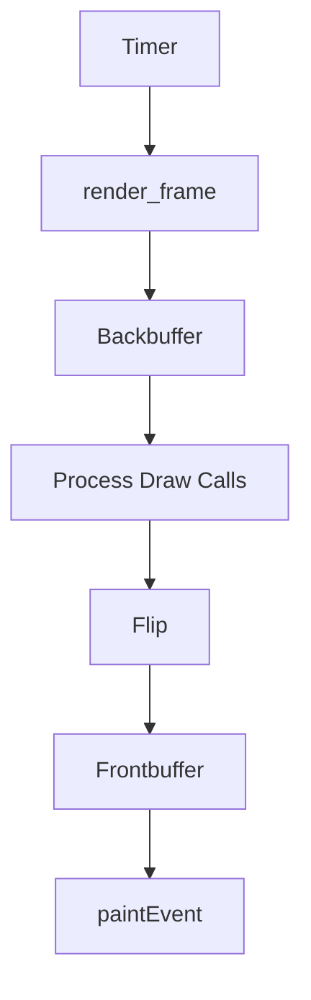

# 🎮 SimulatorWidget - Interface de Renderização do FoxSIM

O `SimulatorWidget` é um componente Qt (QWidget) que substitui o sistema anterior de renderização, oferecendo uma superfície de desenho otimizada com double buffering para simulações de futebol de robôs (VSSS).

## 🖥️ Componentes Principais

### `SimulatorWidget`
Classe baseada em QWidget que gerencia toda a renderização 2D do simulador, com:

- **Double Buffering**: Sistema front/back buffer para renderização sem flickering
- **Controle de FPS**: Renderização em taxa configurável (60 FPS padrão)
- **Sistema de Layers**: Objetos renderizados por camadas (layers)
- **Otimizações**: Uso intensivo de QPainter e recursos Qt nativos

## 🔧 Arquitetura de Renderização

### Fluxo Principal


### 1. Inicialização
- Configura buffers (`_back_pixmap`, `_front_pixmap`)
- Inicia timer de renderização
- Prepara sistema de layers e draw calls

### 2. Ciclo de Renderização (`render_frame()`)
1. Limpa backbuffer
2. Desenha background (se existir)
3. Processa todas as draw calls ordenadas por layer:
   - Imagens
   - Primitivas (retângulos, círculos, linhas, polígonos)
   - Textos
   - Setas (com cálculo vetorial via numpy)
4. Sinaliza necessidade de flip

### 3. Atualização de Tela (`flip()`)
- Troca buffers (back → front)
- Chama repaint da widget

### 4. Exibição (`paintEvent()`)
- Copia conteúdo do frontbuffer para a tela

## 🎨 Sistema de Draw Calls
Todos os elementos são renderizados através do sistema de draw calls:

```python
# Exemplo de draw calls:
back_buffer.add_call(BackBuffer2D.DRAW_IMAGE, image, x, y, layer=1)
back_buffer.add_call(BackBuffer2D.DRAW_PRIMITIVE, "circle", x, y, radius, color, layer=2)
```

## ⚙️ Controles Principais

### Configuração
```python
set_FPS(60)  # Altera taxa de renderização
set_auto_flip(True)  # Flip automático após cada frame
set_render_paused(False)  # Pausa renderização
```

### Métodos Úteis
```python
request_single_frame()  # Força renderização de um frame
start_timer()/pause_timer()  # Controle do timer interno
resizeEvent()  # Redimensionamento responsivo
```

## 🖌️ Métodos de Renderização
Todos os métodos `_render_*` usam QPainter para desenhar no backbuffer:

- `_render_rect()`: Retângulos (preenchidos ou não)
- `_render_circle()`: Círculos e elipses
- `_render_line()`: Linhas simples
- `_render_polygon()`: Polígonos complexos
- `_render_arrow()`: Setas com cálculo vetorial (usando numpy)
- `_render_text()`: Renderização de texto
- `_render_image()`: Imagens com transformações (rotação, escala, transparência)

## 🏗️ Integração com o Simulador
O `SimulatorWidget` se conecta com:

1. **Physics Engine**: Recebe posições dos objetos
2. **Game State**: Obtém informações do placar/tempo
3. **UI Controls**: Responde a pausas/redimensionamentos

## 🚀 Otimizações Implementadas

1. **Double Buffering**: Elimina flickering
2. **Renderização por Layers**: Controle preciso de ordem de desenho
3. **Cálculo Vetorial com Numpy**: Operações matemáticas otimizadas
4. **Controle de FPS Precise**: Timer dedicado para renderização
5. **Renderização Condicional**: Skip de frames quando pausado

## 📊 Estrutura do Componente

```
ui/pages/widgets/
└── SimWidget.py
├── BackBuffer2D.py  # Sistema de draw calls
├── ImageGL.py       # Manipulação de texturas
```

## 💡 Melhorias Futuras

- [ ] Suporte a aceleração por hardware
- [ ] Renderização em thread separada
- [ ] Integração com shaders GLSL
- [ ] Sistema de partículas para efeitos visuais

Este componente substitui com vantagens o sistema anterior de renderização, oferecendo maior controle visual e performance otimizada para o FoxSIM.